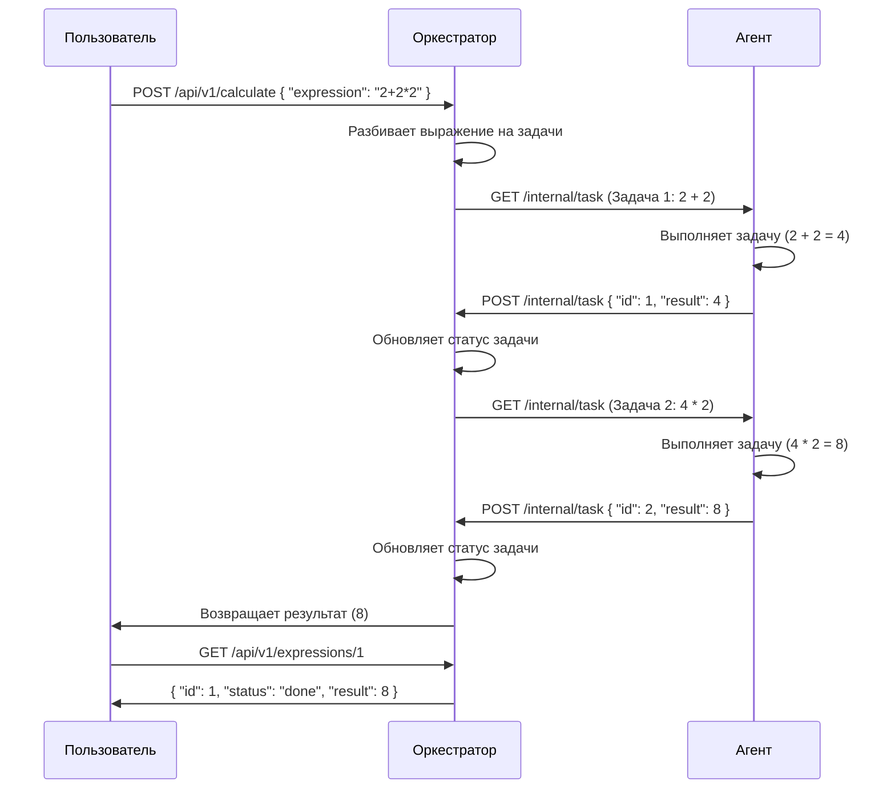

# Распределённый вычислитель арифметических выражений (Calc_2GO)

Этот проект представляет собой распределённый вычислитель арифметических выражений, состоящий из двух основных компонентов:
1. **Оркестратор** — сервер, который принимает арифметические выражения, разбивает их на задачи и управляет их выполнением.
2. **Агент** — вычислитель, который выполняет задачи, полученные от оркестратора, и возвращает результаты.

## Структура проекта
* Calc_2GO/
* ├── cmd/
* │   ├── agent/
* │   │   └── main.go            # Точка входа для запуска агента
* │   ├── orchestrator/
* │   │   └── main.go            # Точка входа для запуска оркестратора
* ├── internal/
* │   ├── agent/
* │   │   ├── agent.go           # Логика агента
* │   │   └── agent_test.go      # Тесты для агента
* ├── calculator/
* │   ├── orchestrator.go        # Логика оркестратора
* │   └── orchestrator_test.go   # Тесты для оркестратора
* ├── models/
* │   └── models.go              # Модели данных (задачи и выражения)
* ├── pkg/
* │   └── calculator/
* │       ├── calculator.go      # Логика калькулятора (разбор выражений)
* │       └── calculator_test.go # Тесты для калькулятора
* ├── .gitignore                 # Игнорируемые файлы для Git
* ├── go.mod                     # Файл модуля Go
* └── README.md                  # Документация проекта


## Запуск проекта

### 1. Убедитесь, что у вас установлена версия Go 1.23 или выше.
Вы можете скачать и установить Go с [официального сайта](https://go.dev/dl/).

### 2. Клонируйте репозиторий:
```bash
https://github.com/A6ra-Kada6ra/Calc_distrib.git
```
### 3. Перейдите в папку проекта:
```bash
  cd <путь_к_проекту>
```

### 4. Запускаем оркестратора:
```bash
go run cmd/orchestrator/main.go
```
### 5. После успешного запуска в консоли высветиться следующее сообщение:
```bash
🚀 Оркестратор запущен на порту 8080
```
* Так же сервис по умолчанию будет достпен на: [http://localhost:8080/api/v1/calculate](http://localhost:8080/api/v1/calculate) 

### 6.  Откройте новый терминал (не закрывая предыдущий) и запустите агент:
```bash
go run cmd/agent/main.go
```
### 7. После успешного запуска в консоли высветиться следующее сообщение:
```bash
🚀 Запуск агента...
```

# Формат запроса
1. Добавление выражения для вычисления
Запрос должен содержать JSON объект со следующей структурой:

## Ожидаемый ответ:
``` json
{
  "expression": "выражение, которое ввёл пользователь"
}
```
*expression — строка, представляющая арифметическое выражение. Поддерживаются операции: сложение (+), вычитание (-), умножение (*), деление (/), а также использование скобок для задания порядка операций.*

## Пример запроса:
```bash
curl -X POST "http://localhost:8080/api/v1/calculate" \
-H "Content-Type: application/json" \
-d '{"expression": "2+2*2"}'
```
## Ожидаемый ответ:

``` json
{
  "id": 1
}
```
*id — уникальный идентификатор выражения, который можно использовать для отслеживания статуса и результата.*

2. Получение списка всех выражений
Этот запрос возвращает список всех выражений, которые были добавлены в систему, вместе с их статусами и результатами (если вычисление завершено).

## Пример запроса:
```bash
curl -X GET "http://localhost:8080/api/v1/expressions"
```
## Ожидаемый ответ:
``` json
{
    "id": 1,
    "status": "pending",
    "result": 0
  },
  {
    "id": 2,
    "status": "done",
    "result": 6
  }
```
id — идентификатор выражения.

status — статус вычисления выражения. Возможные значения:

pending — выражение ещё не обработано.

in_progress — выражение в процессе вычисления.

done — вычисление завершено.

result — результат вычисления. Если вычисление ещё не завершено, значение будет 0.

3. Получение выражения по его ID
Этот запрос позволяет получить информацию о конкретном выражении по его идентификатору.

## Пример запроса:
```bash
curl -X GET "http://localhost:8080/api/v1/expressions/1"
```
## Ожидаемый ответ:
``` json
{
  "id": 1,
  "status": "pending",
  "result": 0
}
```
id — идентификатор выражения.

status — статус вычисления.

result — результат вычисления.

4. Получение задачи для выполнения (внутренний endpoint)
Этот запрос используется агентом для получения задачи от оркестратора. Это внутренний endpoint, который не предназначен для использования пользователем.

## Пример запроса:
```bash
curl -X GET "http://localhost:8080/internal/task"
```
## Ожидаемый ответ:
``` json
}
  "id": 1,
  "arg1": 2,
  "arg2": 2,
  "operation": "+",
  "operation_time": 1000000000
}
```

id — идентификатор задачи.

arg1 — первый аргумент операции.

arg2 — второй аргумент операции.

operation — операция, которую нужно выполнить (+, -, *, /).

operation_time — время выполнения операции в наносекундах.

5. Отправка результата выполнения задачи (внутренний endpoint)
Этот запрос используется агентом для отправки результата выполнения задачи обратно в оркестратор. Это внутренний endpoint, который не предназначен для использования пользователем.

## Пример запроса:
```bash
curl -X POST "http://localhost:8080/internal/task" \
-H "Content-Type: application/json" \
-d '{"id": 1, "result": 4}'
```
## Ожидаемый ответ:
``` json
{""}
```
Ответ пустой, если операция выполнена успешно.


## Ограничения и требования к запросу

Калькулятор имеет следующие ограничения и требования к арифметическим выражениям, которые он может обрабатывать:

Поддерживаемые операции:
- Сложение (`+`)
- Вычитание (`-`)
- Умножение (`*`)
- Деление (`/`)

Особенности обработки:
- Калькулятор поддерживает использование скобок для задания порядка операций.
- Допускаются пробелы между операциями и числами.
- Числа могут быть целыми.

Ограничения:
- Запрос с пустым выражением приведет к ошибке 422 (некорректное выражение).
- Деление на ноль вызовет ошибку 422.
- Калькулятор не может обрабатывать:
  - Нечисловые символы (например, буквы или специальные символы, отличные от разрешенных операций и скобок).
  - Неверное использование скобок (например, если скобки не сбалансированы).
  - Строки, содержащие более одного оператора подряд без операндов (например, `2++2`).

## Пример запросов
**Успешный запрос:**
```bash
curl -X POST "http://localhost:8080/api/v1/calculate" \
-H "Content-Type: application/json" \
-d '{"expression": "2+2*2"}' -i
```
Ожидаемый ответ:
``` json
{"id": 1}
```
**Запрос с ошибкой 422 (неверное выражение):**
```bash
 curl -X POST "http://localhost:8080/api/v1/calculate" \
-H "Content-Type: application/json" \
-d '{"expression": ""}' -i
```
ожидаемый ответ:
``` json
{ "error": "Expression is not valid"}
```
**Запрос с ошибкой 500 (Внутренная ошибка):**
```bash
curl -X POST "http://localhost:8080/api/v1/calculate" \
-H "Content-Type: application/json" \
-d '' -i
```
ожидаемый ответ:
``` json
{"error": "Internal server error"}
```
### Настройка времени выполнения операций
Время выполнения операций задается переменными среды в миллисекундах:

* TIME_ADDITION_MS — время выполнения операции сложения.

* TIME_SUBTRACTION_MS — время выполнения операции вычитания.

* TIME_MULTIPLICATION_MS — время выполнения операции умножения.

* TIME_DIVISION_MS — время выполнения операции деления.

## Пример настройки:

```bash
export TIME_ADDITION_MS=1000
export TIME_SUBTRACTION_MS=1000
export TIME_MULTIPLICATION_MS=1000
export TIME_DIVISION_MS=1000
```
Настройка вычислительной мощности агента
Количество горутин (вычислительных мощностей) агента регулируется переменной среды COMPUTING_POWER.

**Пример настройки:** 

```bash
export COMPUTING_POWER=2
```
Тестирование
Для запуска тестов выполните:

```bash
go test ./...
```
### диаграмма:


